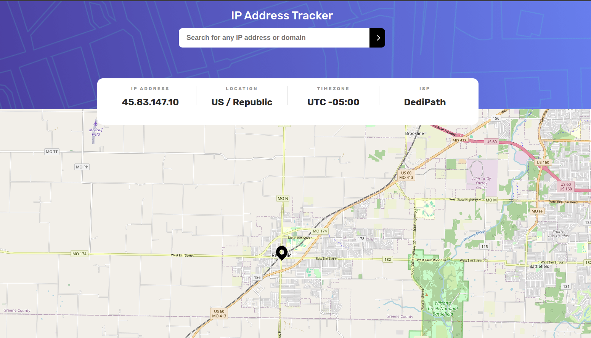

# Frontend Mentor - IP address tracker solution

This is a solution to the [IP address tracker challenge on Frontend Mentor](https://www.frontendmentor.io/challenges/ip-address-tracker-I8-0yYAH0).

## Table of contents

- [The challenge](#the-challenge)
- [Screenshot](#screenshot)
- [Links](#links)
- [Built with](#built-with)
- [Author](#author)

## The challenge

Users should be able to:

- View the optimal layout for each page depending on their device's screen size
- See hover states for all interactive elements on the page
- See their own IP address on the map on the initial page load
- Search for any IP addresses or domains and see the key information and location

## Screenshot

## Links

- Solution URL: [GitHub project page](https://github.com/kondzerau-ivan/ip-address-tracker-master)
- Live Site URL: [Go to Live](https://ip-address-tracker-master-2bvx.vercel.app/)

## Built with

- Parcel as bandler
- Vercel for deployment and hosting

## Author

- Website - [GitHub](https://github.com/kondzerau-ivan)
- Frontend Mentor - [@kondzerau-ivan](https://www.frontendmentor.io/profile/kondzerau-ivan)
- LinkedIn - [Ivan Kondzerau](https://www.linkedin.com/in/ivan-kondzerau/)
